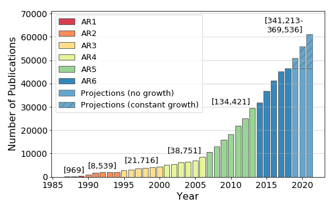
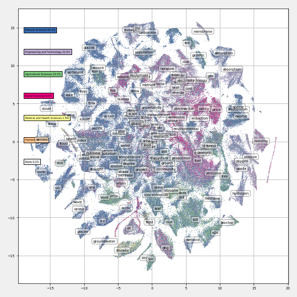
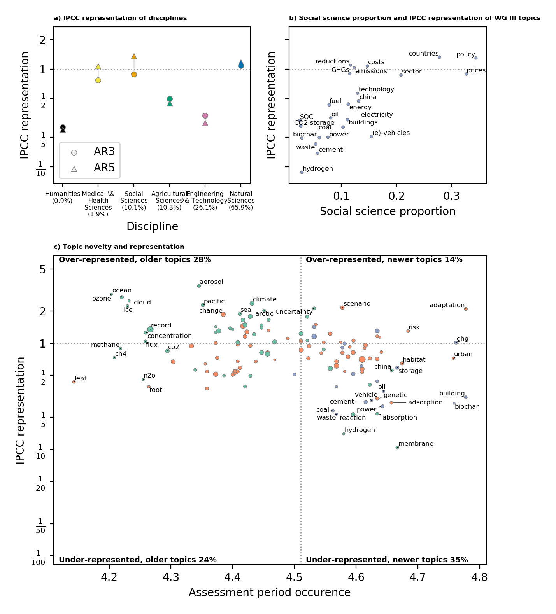

# A Topography of Climate Change Research

## Repository Information

This repository contains the code for the paper *A Topography of Climate Change Research* published in Nature Climate Change:

Callaghan, M.W., Minx, J.C. & Forster, P.M. A topography of climate change research. Nat. Clim. Chang. (2020). https://doi.org/10.1038/s41558-019-0684-5. 

A Read only version of the manuscript is available here: https://rdcu.be/b0O1o.

It depends heavily on https://github.com/mcallaghan/tmv, which is an extension to a platform to view topic models in a web browser written by Allison J.B Chaney. It has been extended into a framework for managing collections of scientific documents and topic models.

Model runs are created using the `do_nmf` function of that framework, which runs topic models on collections of documents. The script in this repository at `code/run_models.py` sets up these model runs.

The results of the topic model are analysed with the scripts and notebooks contained in this repository's `code` folder, where the plots accompanying the paper are created. Some, like `topic_dis.ipynb`, work with the data in this repository, and can be easily run again. Many other parts of this repository, though, depend on access to a database as part of tmv. This takes a bit more time to set up

## A Topography of Climate Change Research

In the paper we look at 400,000 articles about climate change which we downloaded from the Web of Science (these are not included in the data published for copyright reasons).

We produce a topic model of these papers' abstracts, using Non-Negative Matrix Factorisation (NMF). The script `code/run_models.py` sets up a variety of these models with different parameters. These are run and saved into a database according to https://github.com/mcallaghan/tmv, which is a django application that manages scientific documents and topic models.

With topic modelling, we use topics as a dimensionality reduction technique. Each topic has a vector of word scores, and each document has a vector of topic scores. We further reduce the document-topic scores into 2 dimensions using t-SNE. This locates each document in a 2 dimensional space which aims to preserve the high-dimensional topic space. In other words, if documents are about similar topics, they will be close together in this 2 dimensional space.

We then plot this space onto what we call a "Topographic Map" which we can generate in various ways in the `code/t-sne.ipynb` notebook:

Within our database, we match the documents in our query with a set of IPCC citations which we entered into our database. This means we have a subset of climate change relevant documents from the Web of Science which were cited by the IPCC. For any group of documents, we can the proportion of IPCC cited documents belonging to that group with the share of all documents that belong to that group. If the proportion of IPCC cited documents belonging to that group is higher, then we can say that that group is "over-represented" in IPCC citations. This is clearly not an evaluation of how things *should be* but simply an observation of representation that is not perfectly proportional (it doesn't necessarily have to be!)

We look at the over- or under- represented groups of documents. This is interesting because some differences are surprising and some fit in with impresssions we get from other sources. 

In Figure 3.a we see that the social sciences, by AR5, are over-represented, while engineering & technology and agricultural sciences are under-represented. This is surprising, because there was a general feeling in the literature that the IPCC was not doing a good job of incorporating social science knowledge. This was mostly based on a study by Bjurström and Polk in 2011, although this study only looked at the distribution of IPCC citations across disciplines, but did not put this distribution into the context of the wider research landscape.

Bjurström, A. & Polk, M. Climatic Change (2011) 108: 1. https://doi.org/10.1007/s10584-011-0018-8

Again, by over-represented, what we mean exactly is that, when we look at all studies published before the last IPCC report, indexed in web of science, and matching our broad climate change query, the proportion categorised as social science is greater in the subset cited by the IPCC than in the whole set of documents. 

Figure 3.b shows us another interesting and related result. We plot those topics which are mainly cited by working group III of the IPCC (the one that deals with mitigation) and show how much of that topic is made up of social science documents, and how well that topic is represented by the IPCC. Topics with more social science are better represented in IPCC reports

Figure 3.c finally shows all the topics, how new they are (specifically the x axis is the centre of the topics' distribution over assessment periods - see figure 1 for why these are all so close to 5), how well represented they are, and which working group cites them the most. We see a cluster of new and under-represented topics in the bottom right that is really interesting. Some of these are the mitigation topics which don't contain much social science that we saw earlier. In general they are about climate "solutions", and mainly technical. This is interesting because policymakers have given the IPCC feedback that asks for more focus on solutions in future assessment reports.

We conclude from these results that the evidence to support the hypothesis that the IPCC is biased against social science research is not very strong. In fact it looks likely that it is doing a comparitively good job. This doesn't mean, though, that the IPCC should cite less social science research in the future though. It may be true that the IPCC still needs to include more social science knowledge, but that we also need to produce more of that knowledge. It may be particularly useful to conduct more social science research on what have so far been mostly technical topics, like negative emissions and the buildings sector.
