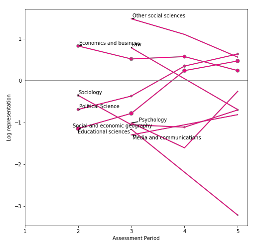
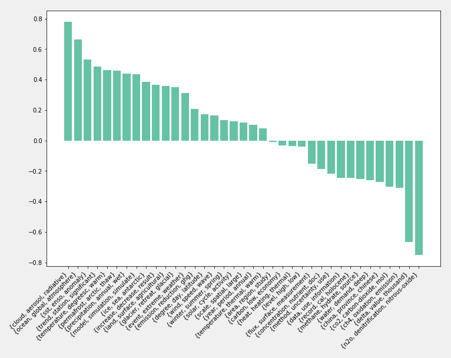

## Progress
- [x] Query updated with WoS Core [Leeds] only, new runs
- [x] Run Blei DTM on the PIK cluster
- [x] Economics within social sciences

  - Economics has remained over-represented
  - Political science and social and economic geography large under-represented literatures that have now become over-represented
  - Sociology and Psychology remain small parts of the literature that are also under-represented
- [ ] Relate this to arguments from the literature - still needs to be done more systematically
- [ ] Relate new topics to AR6 space

#### Query:
  - ~1000 extra IPCC references matched through better fuzzy matching
  - missing GHG in query loses around 1000 almost all relevant results
  - Several potentially important journals missed out, hundreds of journals containing climate change not included

## Discussion
  - What of the WGI Topics and their representation?
  
