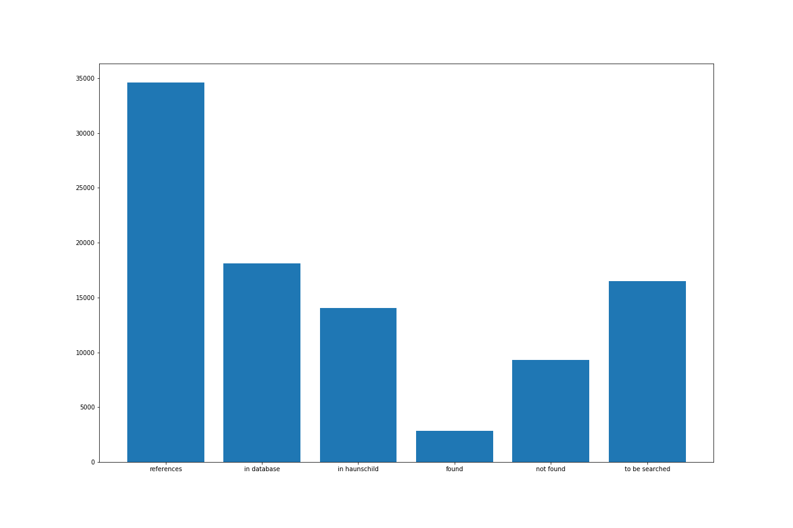
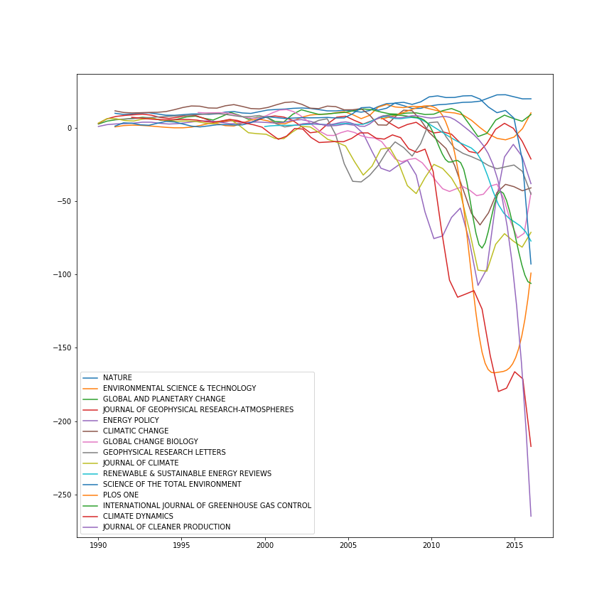
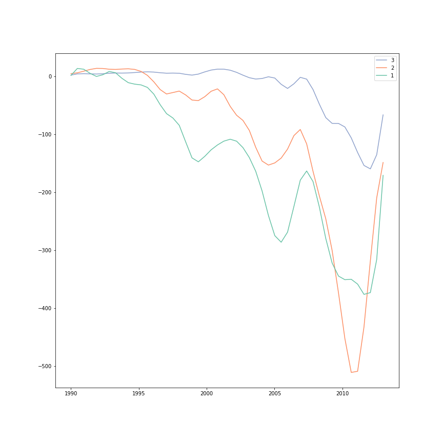
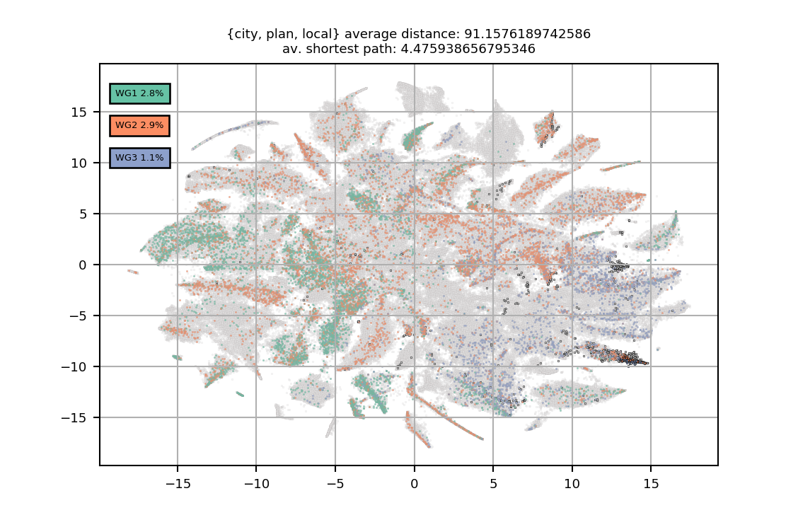
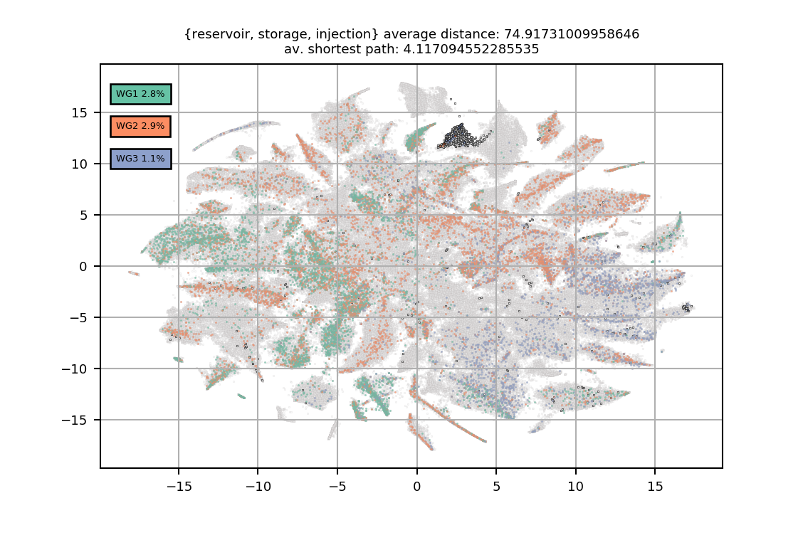
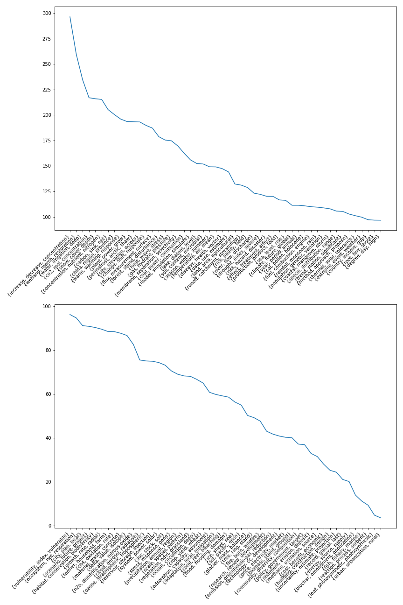
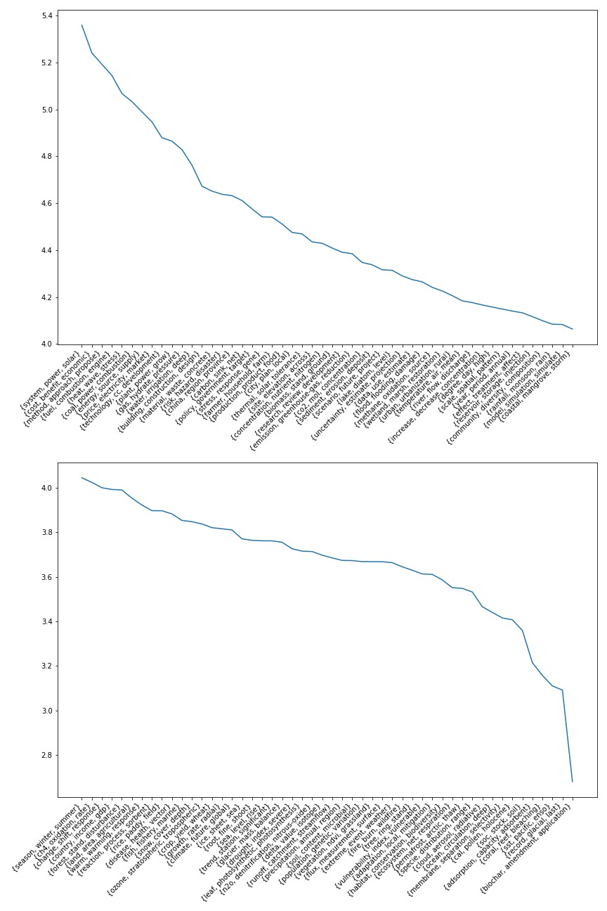
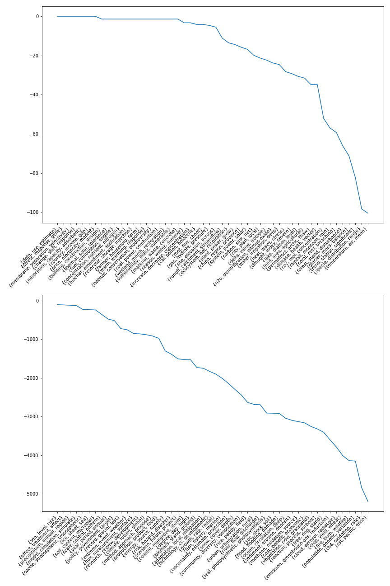
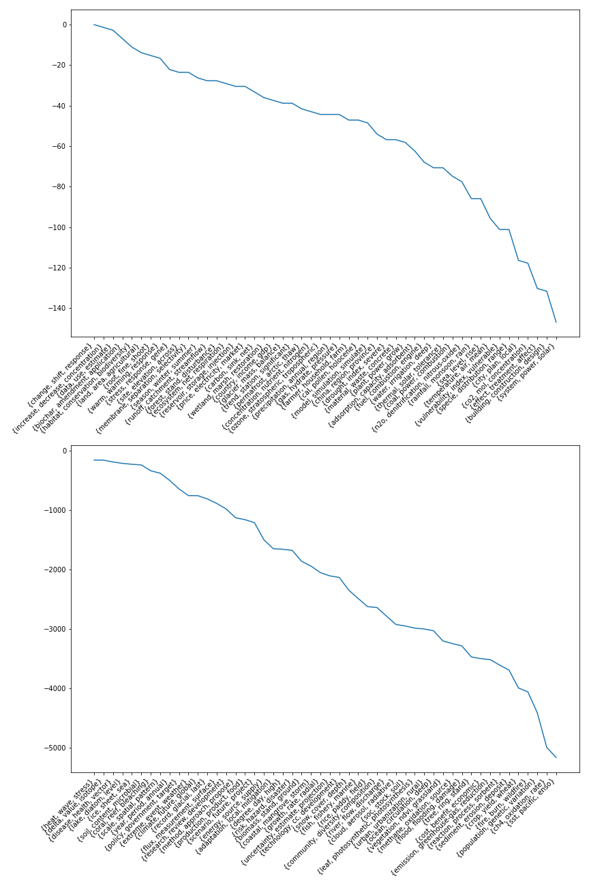
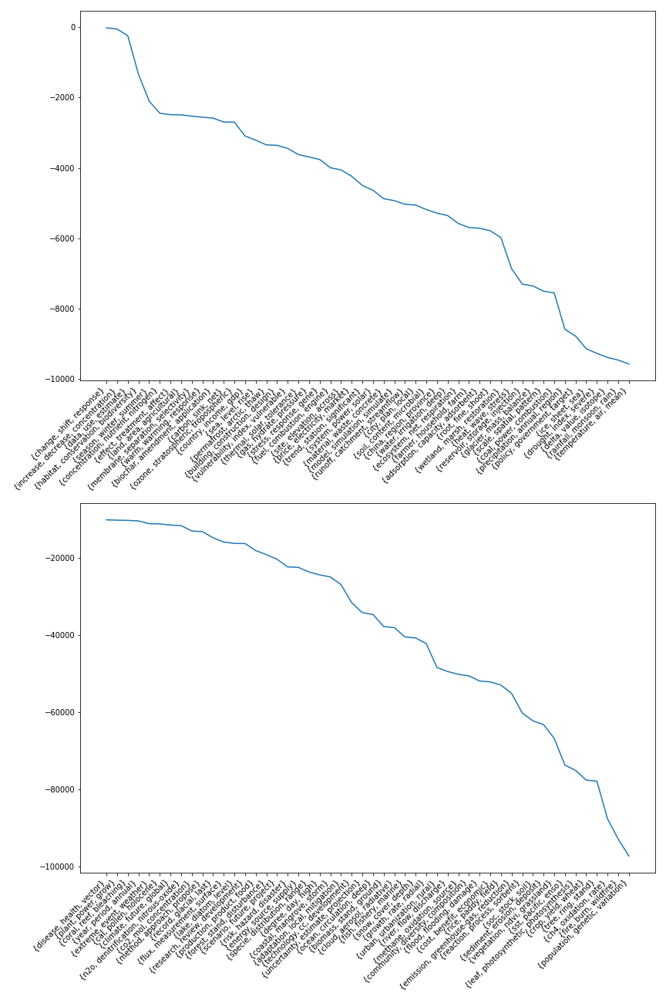

# A topography of climate change literature

## Progress

### IPCC matching

Almost half of unmatched AR5 citations searched for, of which about a quarter
have been found

Scopus scraping is down again, and needs to be fixed before I continue

### Topic entropy across ...

Entropy measures the distribution of a variable within a subset of documents,
high scores indicate that the subset contains a balanced mixture of the variable,
while low entropy indicates that a small number of variable values predominate
in the distribution.

#### Journals

#### IPCC working groups

### TSNE plots

### Topic info

#### Topic distance

#### Topic path length

#### Topic wg entropy

#### Topic oecd entropy

#### Topic kw entropy

### Network validation
valid? make sense?

journal / ipcc entropy of topics
