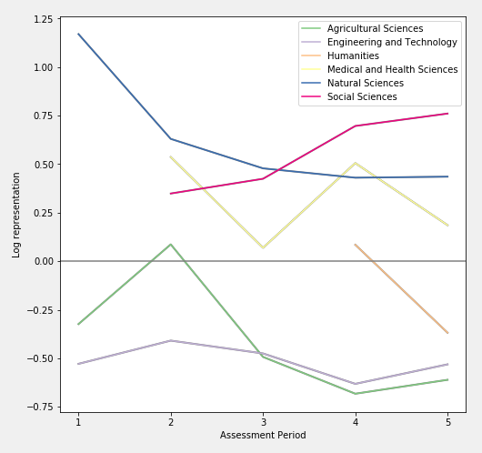
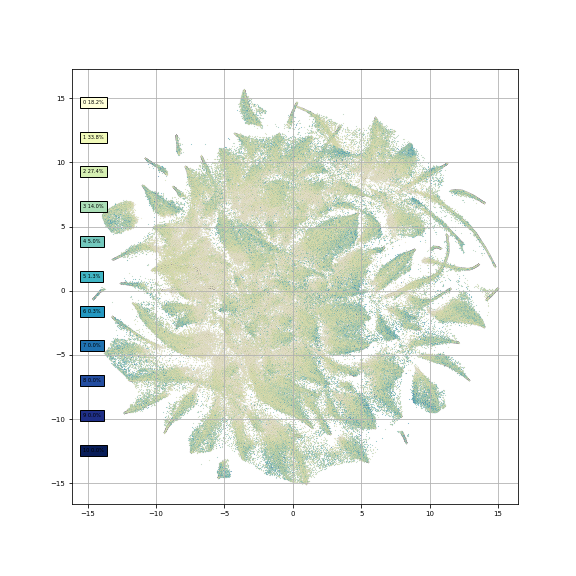
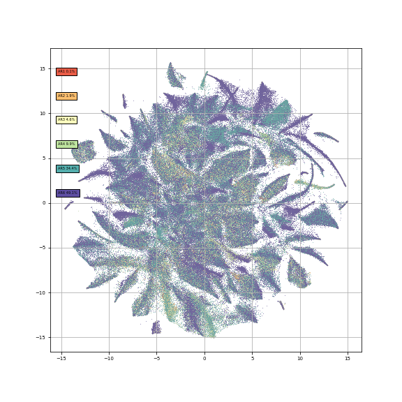
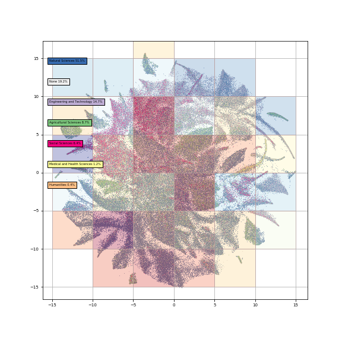
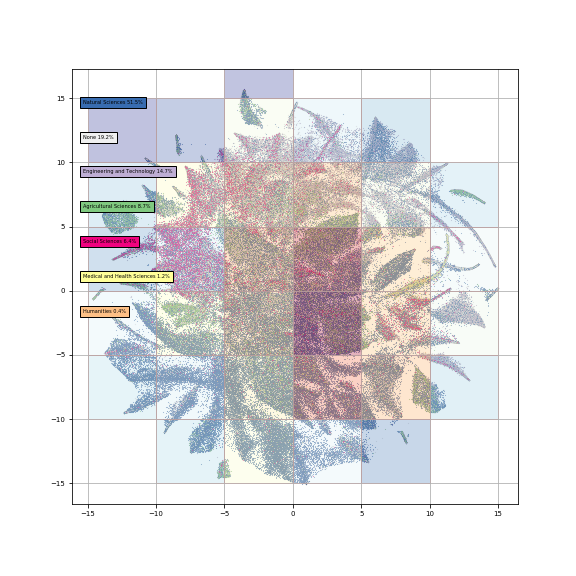
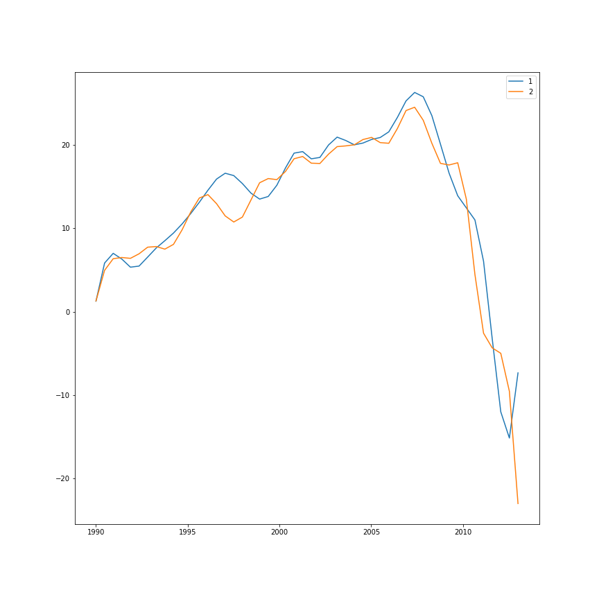
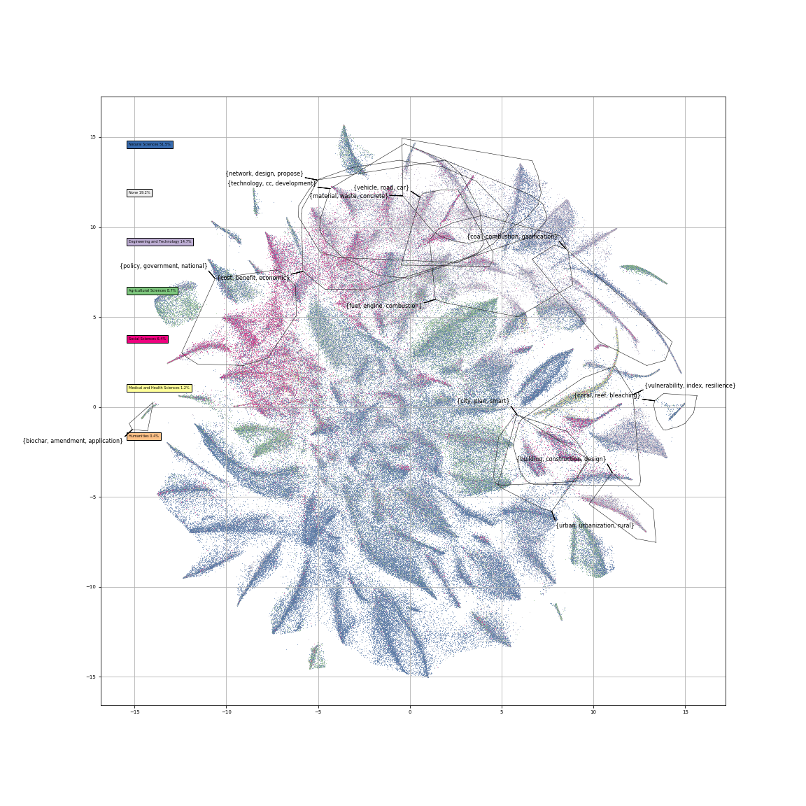

# A topography of climate change literature

## Progress
- [x] Get scopus up and running again
- [x] Add Leeds results
  - But need to rerun, as "all databases" returns non-uniqe documents -> Just do WoS Core
- [x] Disciplinary categories vs. IPCC

- [x] colour dots according to n topics above a certain threshold (thickness)

- [x] Cluster heatmap

### time squares

### Entropy squares

- [x] Sense-check entropy by checking on random variable

  - Actually opposite trend to WGs / journals, but clear problem with AR5 [need to reassess n topics]

- Run Blei DTM on the PIK cluster
  - When sure of document set
- Try sample of documents with DTM
  - should do now
- What kind of documents?
  - ?

- story all the way through same topics etc.

  - in progress in accompanying document
